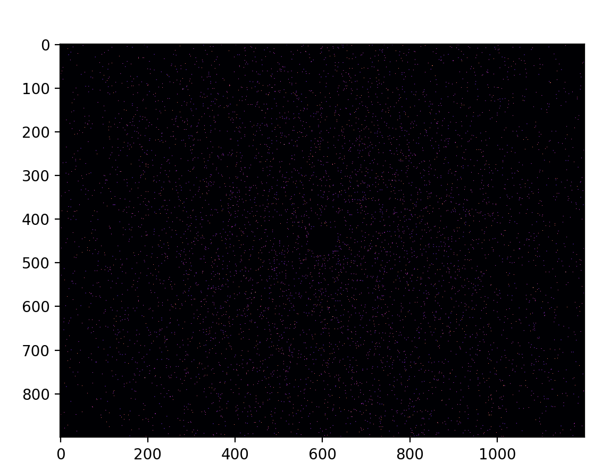

#  Gravity Simulation
An OpenCL implementation of gravity. 
- Works with Nvidea and AMD GPU
- Add as many unitary mass particles, and stationary particle at center of space with 99% of mass of the entire system. 

## Installation

```sh
git clone https://github.com/arestrepo99/GravitySimulation
```

## Requirements

```sh
pip install numpy,pyopencl
```
## Example Outputs 
https://youtu.be/pueIZV-wzVE

https://youtu.be/0b5-ghetJ-g
## Example Code

```python
from Space import Space
import numpy as np
import matplotlib.pyplot as plt

G = 6.7e-11
N = 10000
pos = 1000*np.random.randn(N,2)
r = np.sqrt(pos[:,0]**2+pos[:,1]**2)
# Orbit velocity for star at center weighing 99% of mass
vel = np.sqrt(G*N*99/r**3).reshape((-1,1))*pos.dot([[0,-1],[1,0]])

space1 = Space(pos,vel)
img = space1.step(1e5, zoom = 4e-1)
plt.imshow((np.tanh(img*10)*255).astype(np.uint8),cmap='magma', vmax=255)
```


